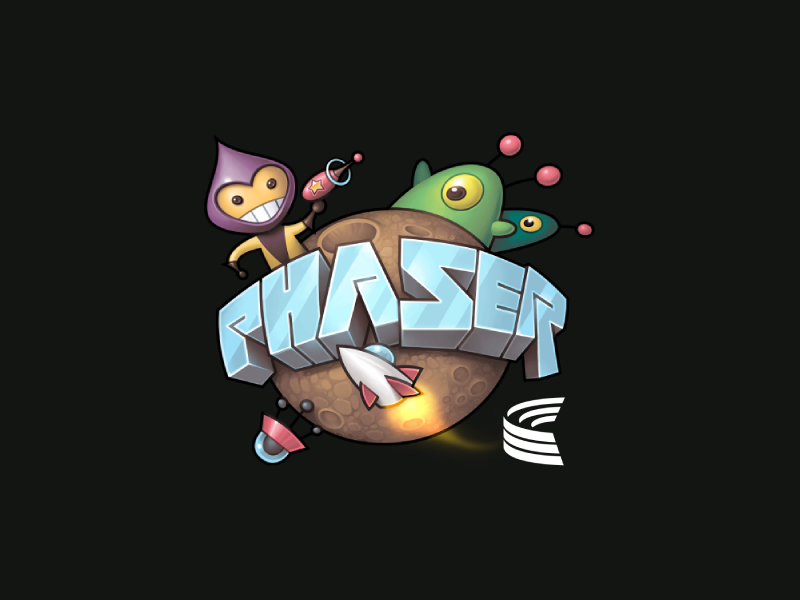

# Phaser: Real Time Multiplayer with Colyseus

This guide will show you how you can build a multiplayer experience with Colyseus Multiplayer Framework and Phaser.

<iframe src="https://colyseus-phaser-tutorial.glitch.me/" width="100%" height="280"></iframe>

## In this tutorial you will learn how to:

- Connect multiple players into a **room**
- Use keyboard **arrow keys** to move current player
- **Interpolate** player's position on the client-side
- Apply **client-prediction** for local user input
- Use **fixed tickrate** to make sure client and server are using the same values, even if a client has lower frame-rate.

## Materials

 [Full source-code on GitHub](https://github.com/colyseus/tutorial-phaser)
 [Live Project on Glitch](https://glitch.com/~colyseus-phaser-tutorial)
