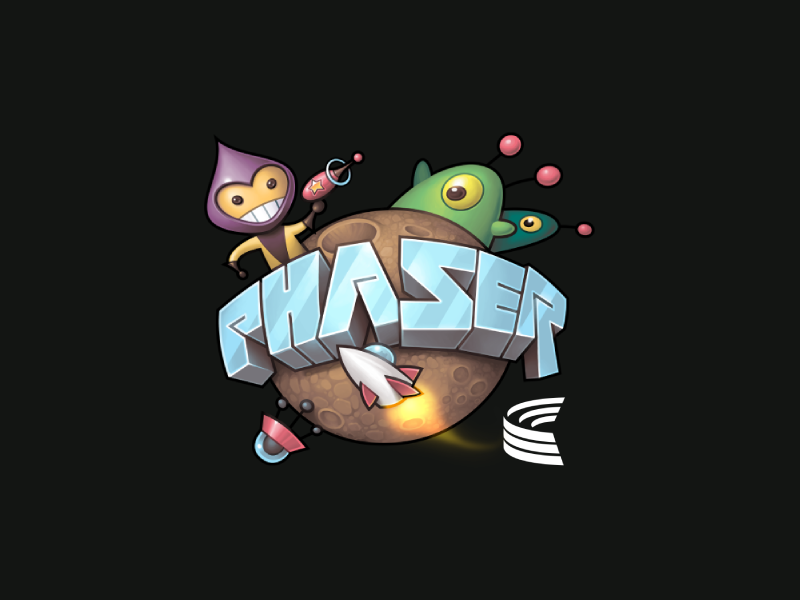

# Part 3: Client Predicted Input

This guide will show you how you can build a multiplayer experience with Colyseus Multiplayer Framework and Phaser.

## In Part 3, we will:

- Update **CURRENT** player position immediately at the rate of the client-side's update loop
- Use linear interpolation to smooth the visual representation of **OTHER** players

<iframe src="https://colyseus-phaser-tutorial.glitch.me/#part3" width="100%" height="280"></iframe>

## Materials

<span class="icon icon-link"></span> [Part 3: Phaser Scene source-code](https://github.com/colyseus/tutorial-phaser/blob/master/client/src/scenes/Part3Scene.ts)
<span class="icon icon-link"></span> [Part 3: Colyseus Room source-code](https://github.com/colyseus/tutorial-phaser/blob/master/server/src/rooms/Part3Room.ts)

---

<span class="icon icon-link"></span> [Full source-code on GitHub](https://github.com/colyseus/tutorial-phaser)
<span class="icon icon-link"></span> [Live Project on Glitch](https://glitch.com/~colyseus-phaser-tutorial)

# Why do we need client-side prediction?

Networked multiplayer games are always going to have _some_ delay between the server and the client.

Client-side prediction is a technique used to reduce the _perceived_ delay of the local player, by giving immediate feedback while its inputs and/or messages haven't reached the server yet.

This tutorial is going to cover one possible solution for player movement using keyboard input. Depending on the type of game you are making, and the outcome you are aiming for, a different technique could work best. There is no "final and correct" answer in this space.

# Detecting the "current player"

During Part 1 and Part 2 of this tutorial, we have treated local and remote players equally, moving them all using the same logic.

We will need to detect which entity represents the current player, to be able to apply custom logic to it.

<!-- ## The "Current Player" -->
---

We are going to identify the current player and keep a special reference to its visual representation in our game scene.

Let's declare the related variables:

```typescript
export class GameScene extends Phaser.Scene {
  // (...)

  currentPlayer: Phaser.Types.Physics.Arcade.ImageWithDynamicBody;
  remoteRef: Phaser.GameObjects.Rectangle;
```

Now, let's modify the `players.onAdd()` callback to identify which player is the current one, by checking the `sessionId` key against the connected `room.sessionId`:

```typescript
this.room.state.players.onAdd((player, sessionId) => {
    const entity = this.physics.add.image(player.x, player.y, 'ship_0001');
    this.playerEntities[sessionId] = entity;

    if (sessionId === this.room.sessionId) {
        // this is the current player!
        // (we are going to treat it differently during the update loop)
        this.currentPlayer = entity;

        // remoteRef is being used for debug only
        this.remoteRef = this.add.rectangle(0, 0, entity.width, entity.height);
        this.remoteRef.setStrokeStyle(1, 0xff0000);

        player.onChange(() => {
            this.remoteRef.x = player.x;
            this.remoteRef.y = player.y;
        });

    } else {
        // all remote players are here!
        // (same as before, we are going to interpolate remote players)
        player.onChange(() => {
            entity.setData('serverX', player.x);
            entity.setData('serverY', player.y);
        });
    }
});
```

The `remoteRef` here is a simple rectangle used to have visual feedback of where the local player is positioned in the server.

# Moving the local player instantly

We need to implement in the client-side the same logic we already have on the server-side for player movement.

Instead of waiting for the acknowledgement of the server, we apply the position change locally at exactly the same instant as sending the input to the server:

```typescript
// (...)
update(time: number, delta: number): void {
    // skip loop if not connected yet.
    if (!this.currentPlayer) { return; }

    const velocity = 2;
    this.inputPayload.left = this.cursorKeys.left.isDown;
    this.inputPayload.right = this.cursorKeys.right.isDown;
    this.inputPayload.up = this.cursorKeys.up.isDown;
    this.inputPayload.down = this.cursorKeys.down.isDown;
    this.room.send(0, this.inputPayload);

    if (this.inputPayload.left) {
        this.currentPlayer.x -= velocity;

    } else if (this.inputPayload.right) {
        this.currentPlayer.x += velocity;
    }

    if (this.inputPayload.up) {
        this.currentPlayer.y -= velocity;

    } else if (this.inputPayload.down) {
        this.currentPlayer.y += velocity;
    }
// (...)
```

> For simplicity sake, we are duplicating the code here. As both server and client are written in TypeScript, you could potentially import a shared implementation and use it on both sides.

## Skipping linear interpolation for the current player 

We are going to change the `update()` method to skip applying linear interpolation for the current player:

```typescript
for (let sessionId in this.playerEntities) {
    // do not interpolate the current player
    if (sessionId === this.room.sessionId) {
        continue;
    }

    // interpolate all other player entities
    const entity = this.playerEntities[sessionId];
    const { serverX, serverY } = entity.data.values;

    entity.x = Phaser.Math.Linear(entity.x, serverX, 0.2);
    entity.y = Phaser.Math.Linear(entity.y, serverY, 0.2);
}
```

Let's go back to your browser and see the results now. You should see the visual representation of the current player always matching the debugging red square (`remoteRef`).

# Simulating latency from the local server

Colyseus provides an utility method you can use during development for simulating network latency. You can use it for checking how the user experience would look like when experiencing latency and delay.

From the server-side, in the `arena.config.ts` file, add the following:

```typescript
gameServer.simulateLatency(200);
```

On the example above, a full round-trip between client messages and the server are going to be of **200ms**.